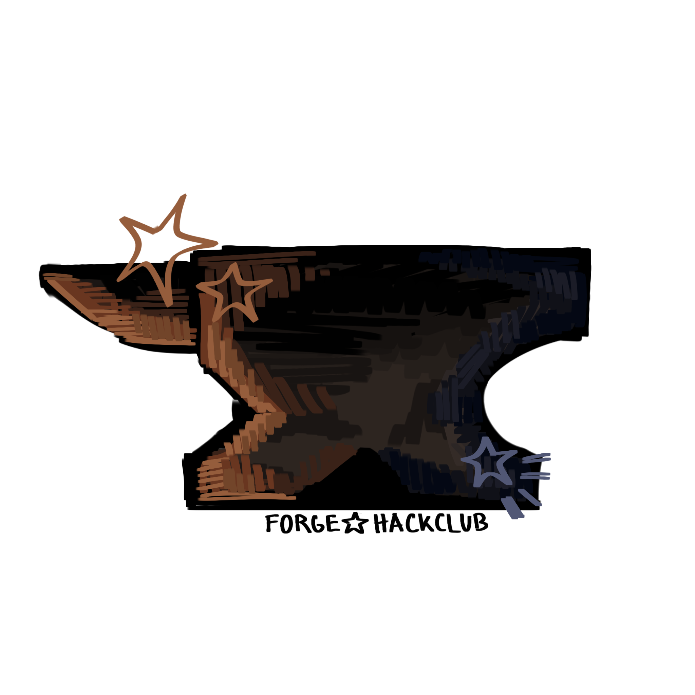
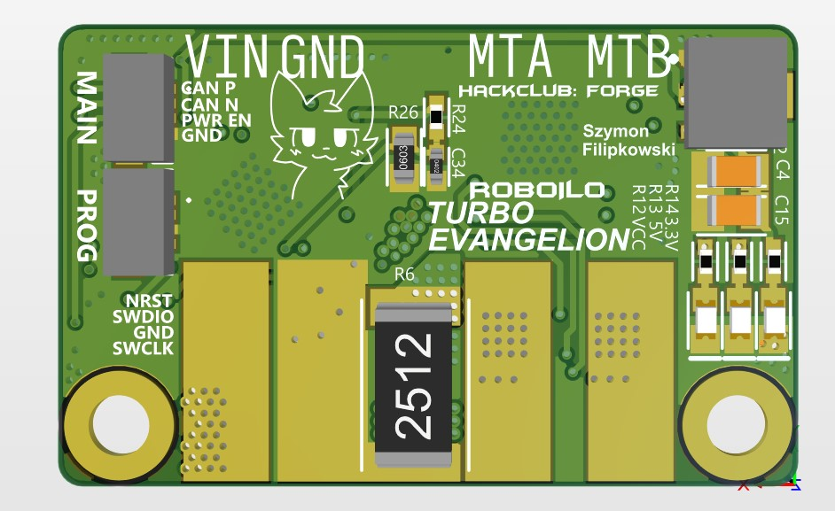
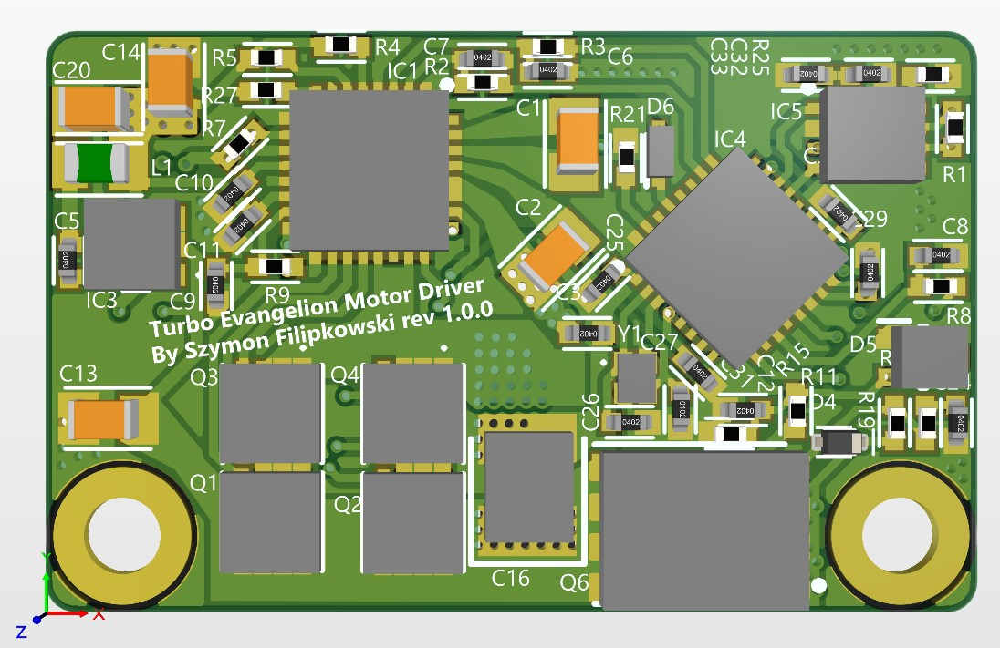
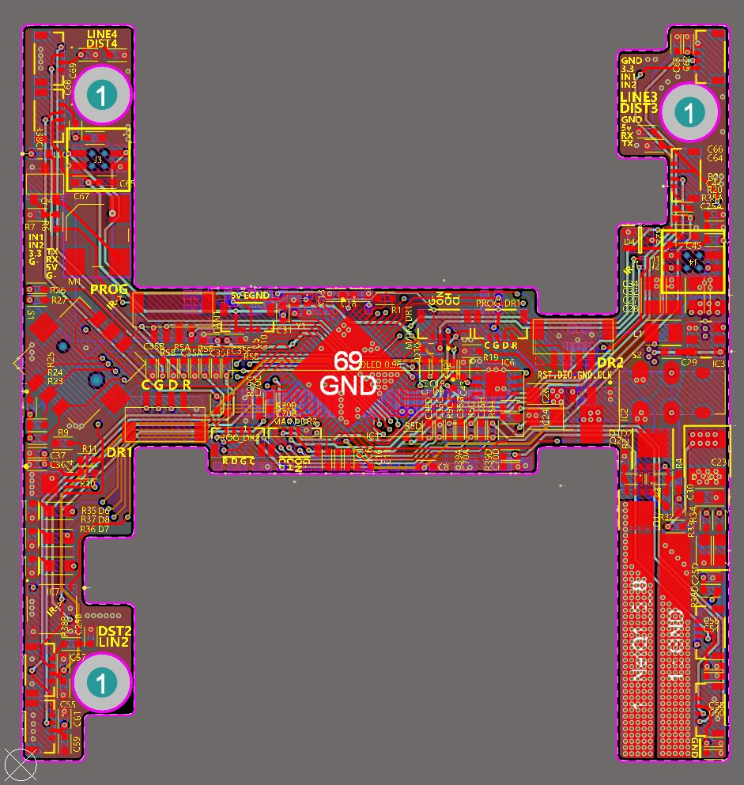
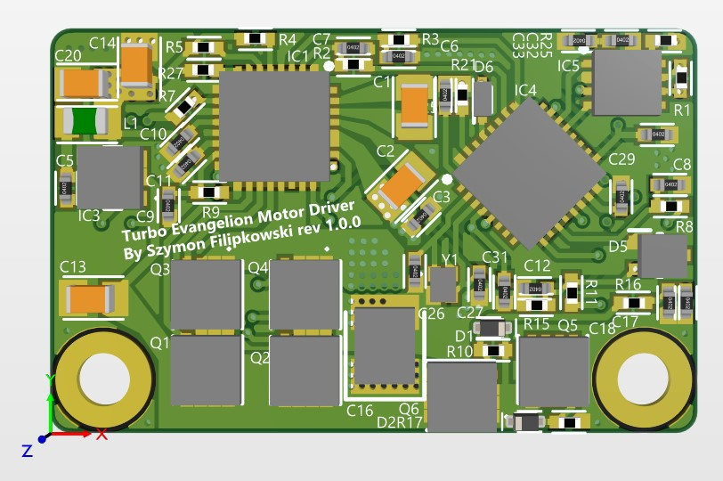
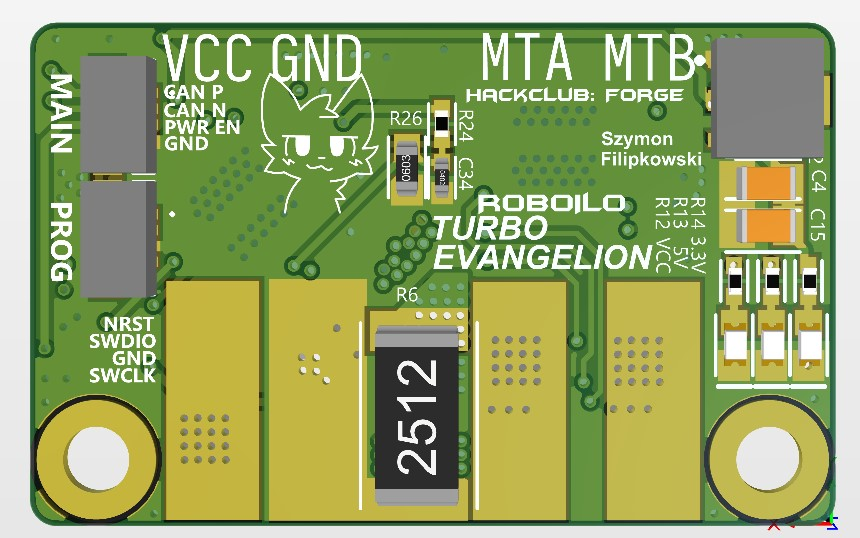
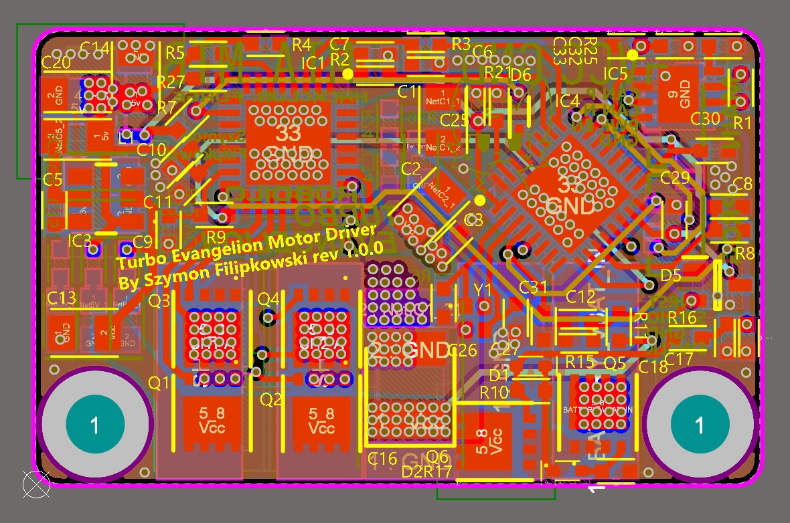
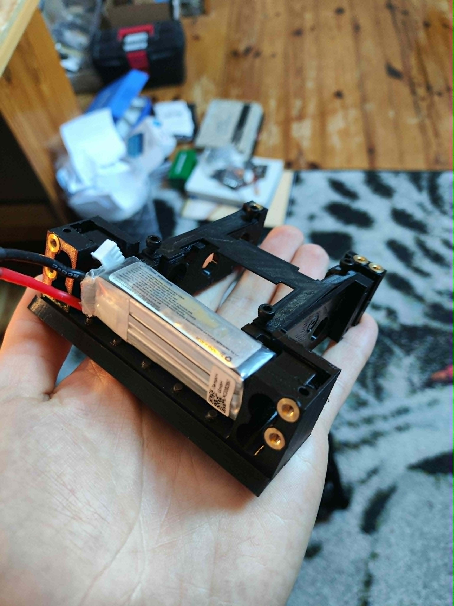
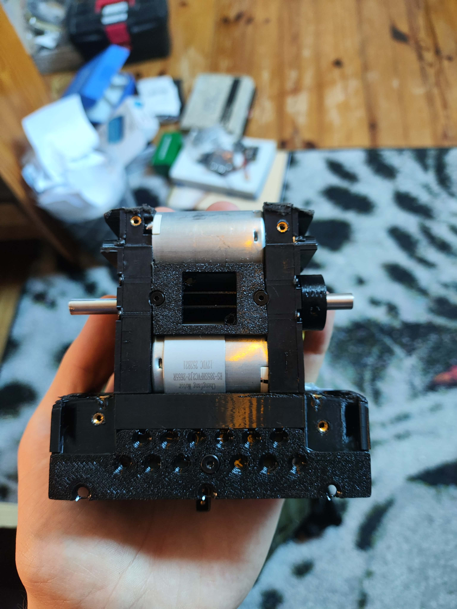

# *Big thanks to those who helped make this project possible:*

  

  
  &nbsp;&nbsp;&nbsp;
  

  
  

---

# Evangelion turbo - my biggest project and most complicated robot yet - succesor to Evangelion
Sumo robot build by me! Designed for RoboRave competition 2026
- 10x10cm robot footprint (max 18-25cm, i think about adding flags)
- max 1kg
- Parts manufactured from steel, aluminium and high performance filaments
- 4 Distance sensors 
- 4 line sensors
- IMU
- shielded motors
- EPROM memory on board
- strong and fast stm32H5 mcu
- 7.5 gear ratio
- powerfull external mosfters motor drivers capable of high current
- two high power brushed DC motors

#### Pros:
 - not tested yet, still in development

#### Cons:
- not tested yet, still in development

#### Accomplishments:
 - not tested yet, still in development

# Photos and images:

## 3D Model:

## Main controller (4 layer PCB):

## Motor driver (4 layer PCB):

## Prototypes:

# Rough BOM:
## [Actual BOM](/BOM.csv):
| Name | Quantity |
|---------------|---------------|
| RS385 dc motor | 2 |
| pololu 37d 19.4:1 gearboxes | 2 |
| tfluna TOF sensors| 4 |
| main controller PCB | 1 |
| motor driver PCB | 1 |
| rised IR receiver PCB | 2 |
| metal 3D printed parts | *a lot* |
| laser cut 1mm and 2mm parts | 3 |
| CNC cut front wedge | 1 |
| *patience* | *more than a lot* |
| electronical components | *see bom. A lot, lol.* |
| silicone for wheel, shore 10A | 0.5Kg |

## *PS. Please - dont copy my work. Watch it, rewiev it, learn from in, take notes - but dont just change a few things and rebuild it. Do better! Make your own better version! Beat me at the next competition!!!*
*This project is out here to **inspire** you, not to be copy and pasted!*

If you want to take a look:
 - 3D files are in the "3DP" folder
 - Board gerber files are in the "altiumik/*name of the PCB, for example "Riser_IR_receiver_PCB"*/Project Outputs *blah blah blag*" You will find them, dont worry
 - Wiring? Everything is written on the PCBs. If you need more, take a look at the PCB files in "altiumik" folder

## Credits

This project uses:
- [Altium Designer](https://www.altium.com/altium-designer) - routing PCB
- [Autodesk inventor](https://www.autodesk.com/products/inventor/overview) - designing all of the parts and assembliess
- [stm32CubeIDE](https://www.st.com/en/development-tools/stm32cubeide.html) - programming the MCU
- [Hack Club Forge](https://forge.hackclub.com/projects/232) - yea, it is my project :)
