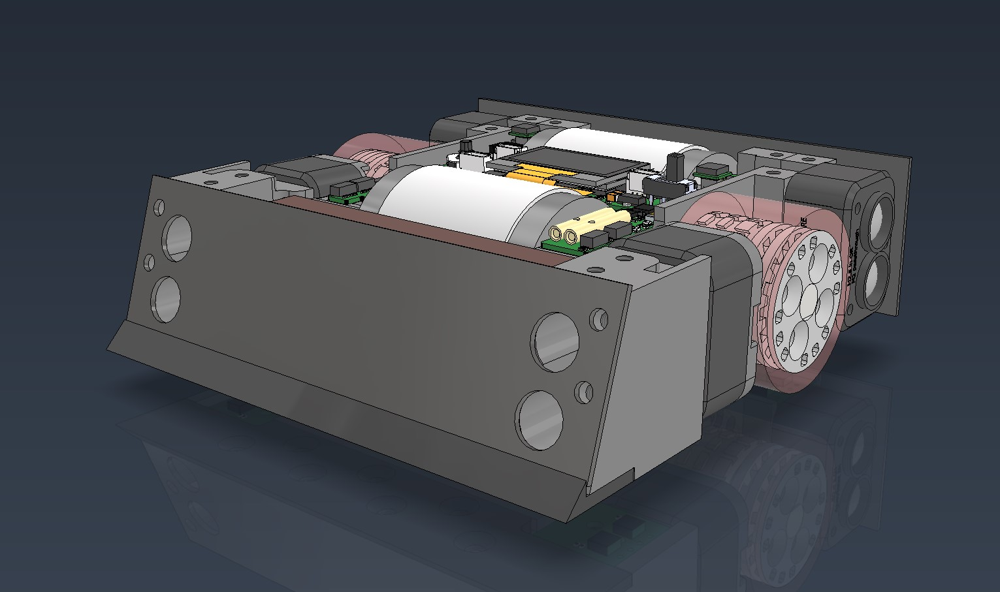
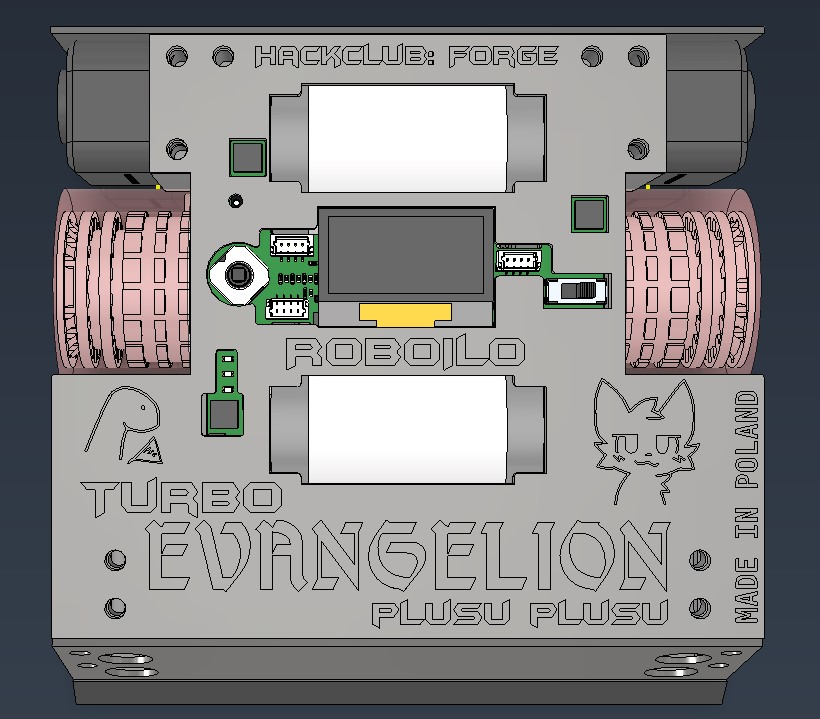
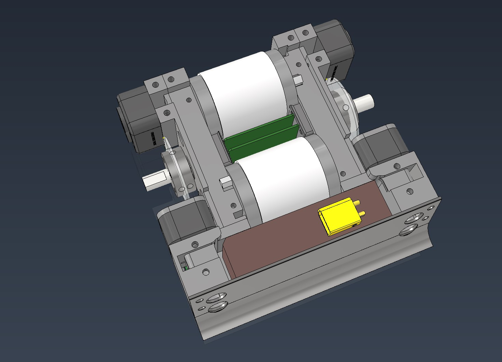
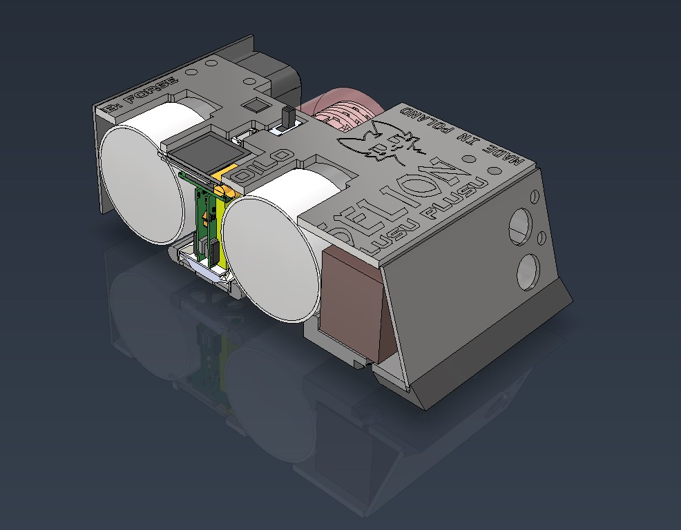

### Evangelion turbo - my biggest project and most complicated robot yet
Sumo robot build by me! Built for RoboRave competition 2026
- 10x10cm robot footprint (max 18-25cm, i think about adding flags)
- max 1kg
- metal parts (i think i will order BJ parts from jlc beacuse they are cheapest, still not cheap tho)
- 4 Distance sensors 
- 4 line sensors
- IMU
- EPROM memory on board
- strong and fast stm32H5 mcu on board
- 7.5 gear ratio
- two big external mosfters motor drivers capable of high current
- two strong motors (8A max each... it will be gooood)

Pros:
 - not tested yet

Cons:
- no buzzer :(
- not tested yet
- still in development

i already put 300ish hours into this robot :)
im still working on main PCB
also i have 3d printed parts in school, so mechanically everything is okay.

Accomplishments:
 - not tested yet

# Images!

3D Model:

Motor driver pcb:

Prototypes:

